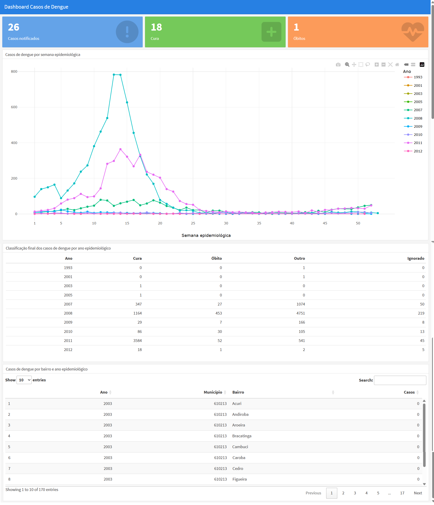

# 📊 Dashboard de Monitoramento de Casos de Dengue

Este projeto apresenta a construção de um dashboard interativo para análise de casos de dengue, utilizando **R** e o pacote **flexdashboard**.

O objetivo é demonstrar como transformar dados epidemiológicos em informações visuais que auxiliam na tomada de decisão em saúde pública.

---

## 🖼️ Preview do Dashboard



---

## 🚀 Tecnologias Utilizadas

* R
* flexdashboard
* tidyverse
* lubridate
* plotly
* DT
* knitr
* RStudio*

---

## Como Instalar o RStudio

👉 https://posit.co/download/rstudio-desktop/

---

## 📂 Estrutura do Projeto

```
.
├── Dados/
│   └── NINDINET.dbf
├── dashboard.Rmd
├── dashboard.html
├── dashboard.jpg
└── README.md
```

---

## 📥 Fonte dos Dados

Os dados são provenientes de um arquivo `.dbf` contendo notificações epidemiológicas.

No projeto, os dados são filtrados para considerar apenas casos de dengue:

```r
dengue <- nindi |>
  filter(ID_AGRAVO == 'A90')
```

---

## 📊 Funcionalidades do Dashboard

O dashboard apresenta:

### 🔢 Indicadores principais

* Total de casos notificados
* Total de curas
* Total de óbitos

### 📈 Visualizações

* Casos por semana epidemiológica (gráfico interativo)
* Classificação dos casos por ano
* Distribuição por bairro

### 📋 Tabelas interativas

* Classificação dos casos (Cura, Óbito, Outros, Ignorados)
* Casos por bairro com paginação

---

## ▶️ Como Executar

1. Clone o repositório:

```bash
git clone https://github.com/andersonmatte/Curso-UFSC-Dashboards-Monitoramento-Saude.git
```

2. Abra o projeto no RStudio

3. Instale as dependências:

```r
install.packages(c(
  "flexdashboard",
  "foreign",
  "tidyverse",
  "lubridate",
  "plotly",
  "DT",
  "knitr"
))
```

4. Execute o arquivo:

```
dashboard.Rmd
```

Ou gere o HTML:

```r
rmarkdown::render("dashboard.Rmd")
```

---

## 🎯 Objetivo Educacional

Este projeto faz parte de estudos voltados à:

* Data Science aplicada à saúde
* Análise epidemiológica
* Construção de dashboards interativos
* Integração com bioinformática

---

## 🔗 Repositório

👉 https://github.com/andersonmatte/Curso-UFSC-Dashboards-Monitoramento-Saude

---

## 👨‍💻 Autor

**Anderson Matte Tamborim**

* Mais de 15 anos na área de tecnologia
* Experiência com Java, Flutter, Angular e Data Science
* Estudos em Bioinformática

---

## 📄 Licença

Este projeto é de uso educacional.
